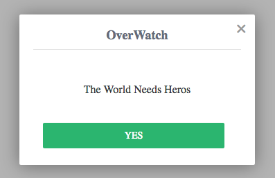
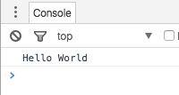

# vue-alert-go
More Details in [api docs](./API.md) :)

Some examples are following:

## Basic
only `title` and `msg`.

```javascript
import vueAlert from '../src'

vueAlert({
  title: 'OverWatch',
  msg: 'The World Needs Heros',
})
```


## Align
you can specify the `align` property to align text.

```javascript
vueAlert({
  title: 'OverWatch',
  msg: 'The World Needs Heros',
  align: 'center', // add this!
})
```




## Type && Icon
There are 2 types, each type has its icon. `sccuess`(ok icon) and `error`(error icon).

Besides, you can overrride the default icon, by specifying `icon` property.

```javascript
// success
vueAlert({
  type: 'success', // or 'error'
  msg: 'The World Needs Heros',
  align: 'center',
})
```


## Handler
If you like, you can add some listeners for some events. e.g. `onClickYesBtn`.

```javascript
vueAlert({
  msg: 'The World Needs Heros',
  align: 'center',
  needNoBtn: true,
  onClickYesBtn() {
    console.log('Hello World')
  }, // add this!
  
  // onClickNoBtn() {}
  // cbWhenClickMask() {}
})
```





## Style
Customize some default styles by `style` prop.

```javascript
vueAlert({
  title: 'OverWatch',
  msg: 'The World Needs Heros',
  style: {
    box: {
      padding: '5px',
      borderRadius: '10px',
      bgColor: '#313131',
    },
    textColor: '#fff',
  },
})
```

## Animate
There some 3 types of animation.

```javascript
vueAlert({
  title: 'OverWatch',
  msg: 'The World Needs Heros',
  animate: 'bound', // fade, bound, slide
})
```